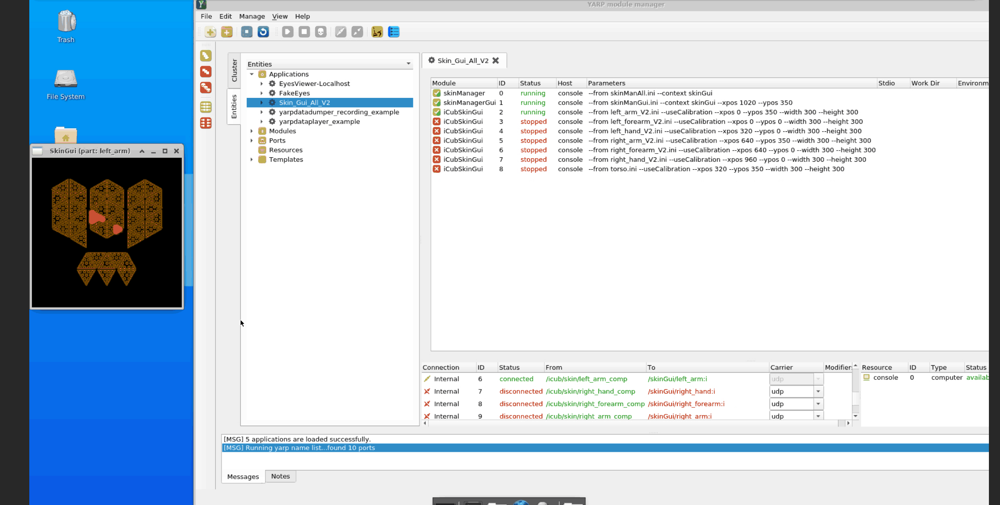

Test Skin Patches
=================

An automated tool to be used during production stage for testing skin patches.

## Instructions to run the docker container
Install [Docker](https://www.docker.com) and make sure to go through these [post-installation steps](https://docs.docker.com/engine/install/linux-postinstall/) on Linux systems.

Once you have Docker properly installed, follow these instructions:
1. Pull the docker image:
    ```sh
    $ docker pull ghcr.io/icub-tech-iit/test-skin-patches:latest
    ```
2. Launch the container:
    ```sh
    $ docker run -it --rm --network host ghcr.io/icub-tech-iit/test-skin-patches:latest
    ```
3. From within the container shell, launch the following scripts:
    ```sh
    $ start-vnc-session.sh
    ```
4. Open up the browser and connect to **`localhost:6080`** to get to the workspace desktop GUI.

## Instructions to test the skin
1. Connect the `ESD USB/CAN` device to the host machine, then:
    ```sh
    $ sudo ip link set can0 type can bitrate 1000000
    $ sudo ip link set up can0
    ```
2. From within the docker container's desktop, open up a terminal for each of the following commands to be launched:
    ```sh
    $ yarpserver
    $ yarprun --server /icubsrv
    $ yarprobotinterface --config <skin_part_.xml>
    $ yarpmanager
    ```
3. From within the yarpmanager GUI:
- Select `Entities` > `Applications` > `SkinGui_All_V2`
- Run `skinManager`, `skinManagerGui` and `iCubSkinGui` related to the part to be tested (in this example `left_arm`)
- Connect the port corresponding to the part to be tested (in this example `left_arm`)
- Touch the skin patch and you'll see the corresponding part highlighting in the GUI.



## How to shut down the docker container
From the container shell, press **CTRL+D**.
 
### 👨🏻‍💻 Maintainers
This repository is maintained by:

| | |
|:---:|:---:|
| [](https://github.com/davidetome) | [@davidetome](https://github.com/davidetome) |
| [](https://github.com/pattacini) | [@pattacini](https://github.com/pattacini) |
