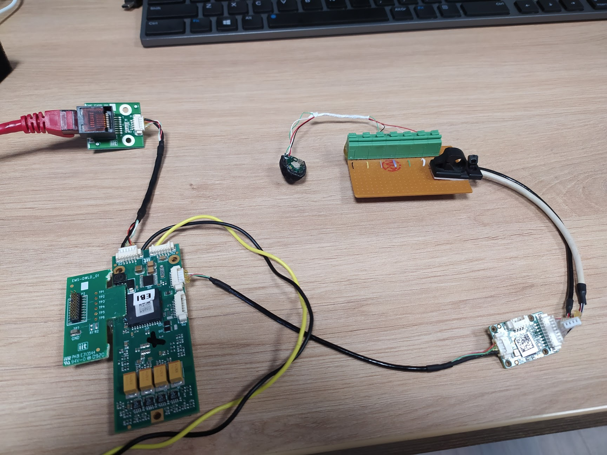
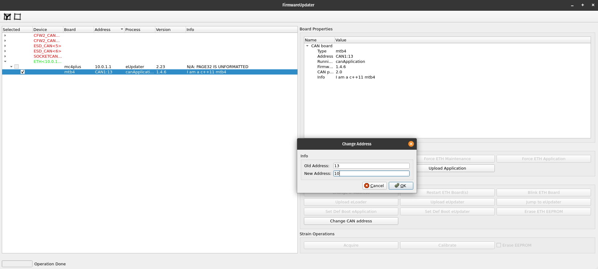
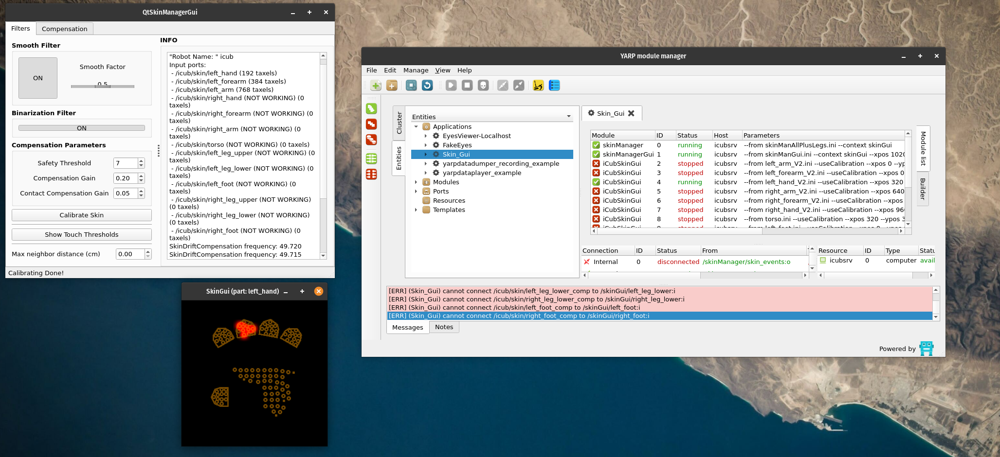

# Test skin patches w/ mc4plus setup
This configuration files will be used to test the skin patched using a `mc4plus`/`mtb4` setup instead of the `USB/CAN` adapter.



Requirements

- Power supply (12Vdc @1A)
- `mc4plus/mtb4/patches connector` setup (see picture above)
- Linux system with `robotology-superbuild` installed (https://github.com/robotology/robotology-superbuild)
- This repo cloned (https://github.com/icub-tech-iit/test-skin-patches.git)


> **Note**
> The `mc4plus` must have the IP addrress set to `10.0.1.1`


## Change mtb4 ID
Change the ID of the `mtb4` accordingly the skin patch is going to be tested
To do that in a terminal run :

```console
cd test-skin-patches/test-skin-mc4plus/config-files
FirmwareUpdater -a
```

Them in the GUI:

- Select the `ETH` interface
- Click on `Discover`
- Select the `mc4plus` just discovered and click on `Force ETH Maintenance`
- Click on `Discover`
- Select the `mtb4` just discovered and click on `Change CAN address`
- input the desired ID and click `OK`
- Select the `mc4plus` and click om `Force ETH Application`



## Test the skin patch
In a terminal run :

```console
cd test-skin-patches/test-skin-mc4plus/config-files
yarpserver
yarp run --server /icubsrv
yarprobotinterface --config <skin-part-to-be-tested.xml> (i.e. yarprobotinterface --config skin-right-arm.xml)
yarpmanager
```

In `yarpmanager` GUI open `skinGui` app and run:

- `skinManager`
- `skinManagerGui`
- `iCubSkinGui` related to the part you're running
- Then click on `Connect All`


